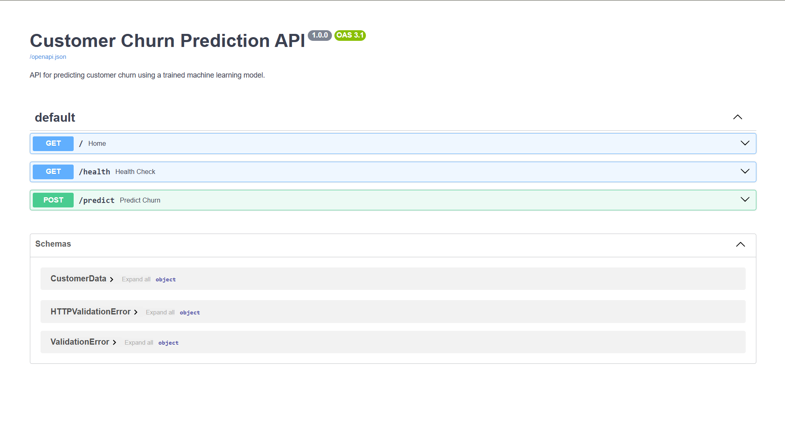
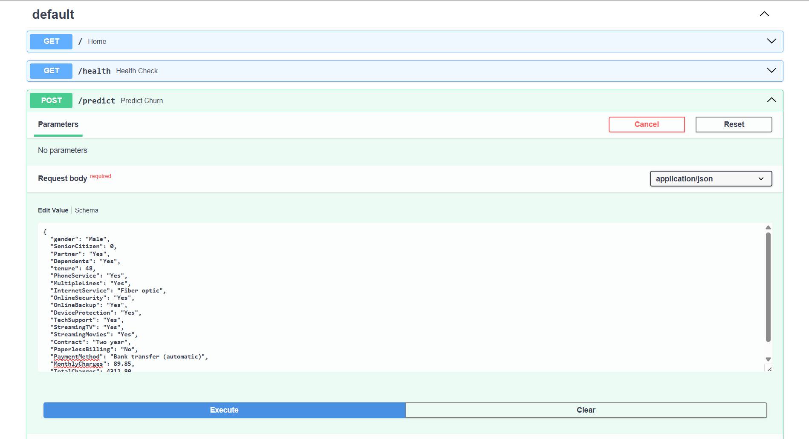
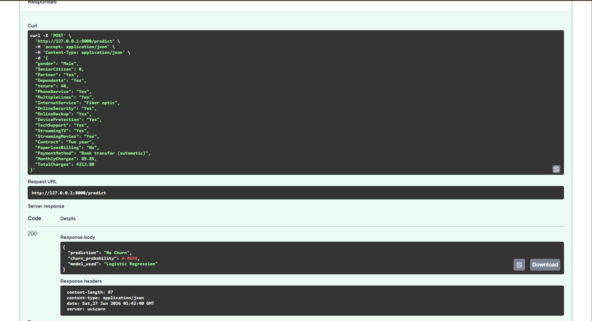
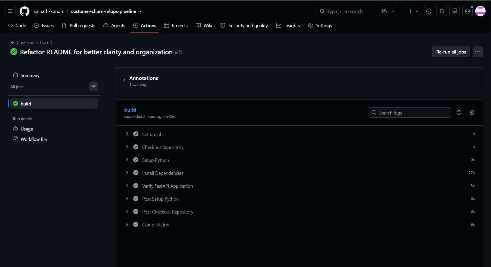
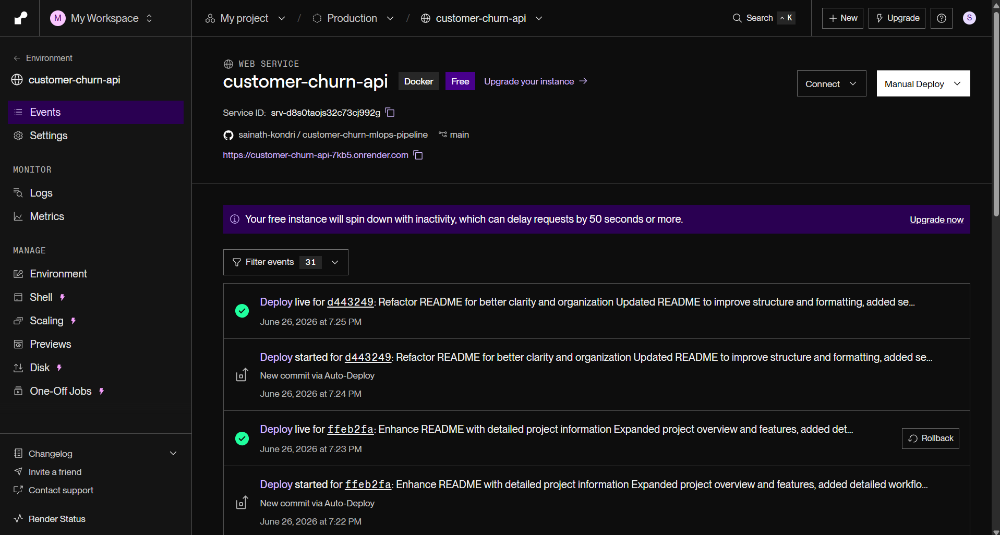
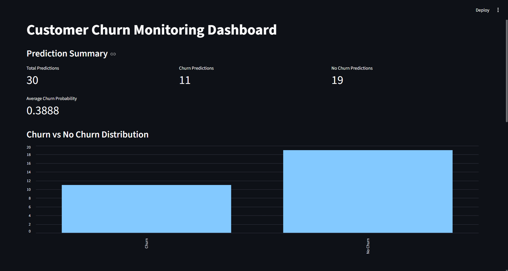
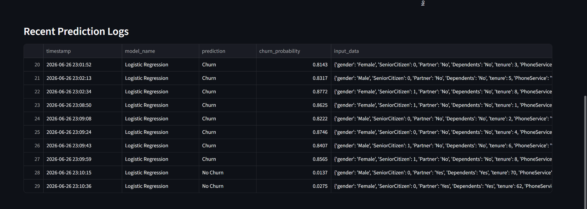

# Customer Churn MLOps Pipeline

An end-to-end Machine Learning and MLOps project for predicting customer churn using the Telco Customer Churn dataset. The project demonstrates the complete machine learning lifecycle, from data preprocessing and model training to deployment, continuous integration, continuous deployment, prediction monitoring, and dashboard-based observability.

---

# 🚀 Live Demo

### Live API

https://customer-churn-api-7kb5.onrender.com

### Swagger Documentation

https://customer-churn-api-7kb5.onrender.com/docs

---

# 📌 Project Overview

This project demonstrates a production-oriented machine learning workflow.

Starting with raw customer data, the project performs preprocessing, feature engineering, model training, and evaluation before packaging the trained model into a FastAPI application. The application is containerized with Docker, deployed on Render, automatically validated through GitHub Actions, and monitored using a Streamlit dashboard that visualizes prediction activity.

The objective is to predict whether a customer is likely to churn based on demographic and service-related information.

---

# 🛠 Tech Stack

## Machine Learning

* Python
* Pandas
* NumPy
* Scikit-learn

## Backend

* FastAPI
* Pydantic

## Deployment

* Docker
* Render

## MLOps

* Git
* GitHub
* GitHub Actions (Continuous Integration)
* Render Auto Deploy (Continuous Deployment)

## Monitoring

* Streamlit
* CSV Prediction Logging

---

# 🔄 Project Workflow

```text
Raw Data
    ↓
Data Preprocessing
    ↓
Feature Engineering
    ↓
Model Training
    ↓
Model Evaluation
    ↓
Model Artifact Creation
    ↓
FastAPI Prediction API
    ↓
Docker Containerization
    ↓
GitHub Repository
    ↓
GitHub Actions (Continuous Integration)
    ↓
Render Auto Deployment (Continuous Deployment)
    ↓
Prediction Request Logging
    ↓
Streamlit Monitoring Dashboard
```

---

# 📸 Project Demo

## 1. FastAPI Swagger UI

Interactive API documentation for testing prediction requests.



---

## 2. Prediction Request

Customer information submitted through the FastAPI Swagger interface.



---

## 3. Prediction Response

Prediction returned by the trained machine learning model, including the predicted class and churn probability.



---

## 4. GitHub Actions CI

Continuous Integration workflow that automatically validates every push to the repository.



---

## 5. Render Deployment

Production deployment of the Dockerized FastAPI application on Render.



---

## 6. Monitoring Dashboard

Monitoring dashboard displaying prediction statistics, churn distribution, and average churn probability.



---

## 7. Prediction Logs

Recent prediction requests captured by the monitoring dashboard.



---

# ✨ Features

## Machine Learning

* Data Cleaning and Preprocessing
* Feature Engineering
* One-Hot Encoding
* Feature Scaling
* Logistic Regression
* Random Forest Classification
* Automatic Best Model Selection
* Model Serialization (.pkl)

## API

* REST API using FastAPI
* Request Validation using Pydantic
* Interactive Swagger Documentation
* Health Check Endpoint

## Monitoring

* Prediction Request Logging
* Customer Churn Monitoring Dashboard
* Prediction Distribution Visualization
* Churn Probability Tracking
* Recent Prediction History

---

# 🌐 API Endpoints

## Home

```http
GET /
```

Returns API information and model status.

---

## Health Check

```http
GET /health
```

Returns application health status.

---

## Predict Customer Churn

```http
POST /predict
```

Returns:

* Prediction
* Churn Probability
* Model Used

Every prediction request is automatically logged for monitoring purposes.

---

# 📦 Deployment

The application is containerized using Docker and deployed on Render.

### Live API

https://customer-churn-api-7kb5.onrender.com

### Swagger UI

https://customer-churn-api-7kb5.onrender.com/docs

---

# 🔁 CI/CD Pipeline

The project uses GitHub Actions for Continuous Integration.

Every push to the **main** branch automatically:

* Checks out the repository
* Sets up Python
* Installs project dependencies
* Starts the FastAPI application
* Verifies the API starts successfully

Once the workflow completes successfully, Render automatically deploys the latest version of the application.

---

# 📊 Monitoring Dashboard

The project includes a Streamlit dashboard that reads prediction logs generated by the API and provides operational insights.

The dashboard includes:

* Total predictions served
* Churn vs No Churn prediction counts
* Average churn probability
* Prediction distribution visualization
* Recent prediction history
* Raw prediction logs

---

# 📁 Project Structure

```text
customer-churn-mlops-pipeline/
│
├── api/
│   ├── main.py
│   └── schema.py
│
├── src/
│   ├── data_preprocessing.py
│   ├── feature_engineering.py
│   └── train_model.py
│
├── monitoring/
│   ├── logger.py
│   ├── dashboard.py
│   └── prediction_logs.csv
│
├── screenshots/
│   ├── swagger-ui.png
│   ├── prediction-request.png
│   ├── prediction-response.png
│   ├── github-actions-ci.png
│   ├── render-deployment.png
│   ├── monitoring-dashboard-summary.png
│   └── monitoring-dashboard-logs.png
│
├── models/
│   ├── churn_model.pkl
│   └── model_metrics.json
│
├── data/
│
├── .github/
│   └── workflows/
│       └── ci.yml
│
├── Dockerfile
├── requirements.txt
└── README.md
```

---

# 👤 Author

**Sainath Kondri**

Machine Learning Engineer
